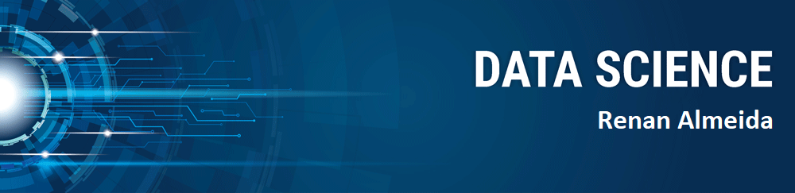

  

  

# Renan Almeida
*Data Scientist*

Como cientista de dados meu objetivo é transformar dados em solução e agregar valor às pessoas. Sempre desenvolvendo minhas habilidades analíticas e me mantendo atualizado das melhores ferramentas e recursos existentes para analisar, processar dados, e construir modelos.
Possui experiências em desenvolvimento de projetos web, mobile e eventos de Hackaton e workshop, onde desenvolvi e aprimorei fortemente as habilidades de liderança, trabalho em equipe e ótima comunicação. 

**Conhecimentos em:** Python, Machine Learning, Estatística, Web Scraping, SQL.

**Links:**
* [LinkedIn](https://www.linkedin.com/in/https://www.linkedin.com/in/renan--gs/)
* [Medium](https://medium.com/@renan_gs)

## Projetos:
Veja meus projetos de Data Science:
* **Reconhecimento de padrões frequentes em sequências de DNA:** http://bit.ly/3UzPHnc 
